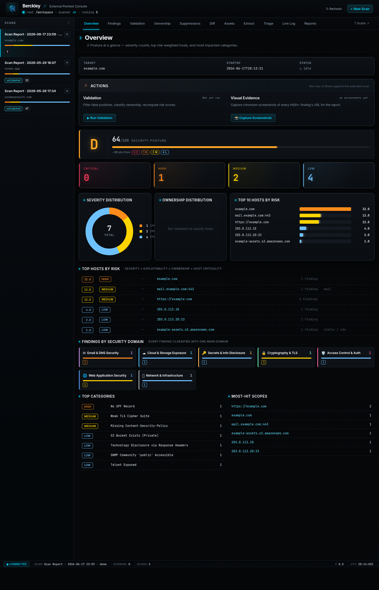
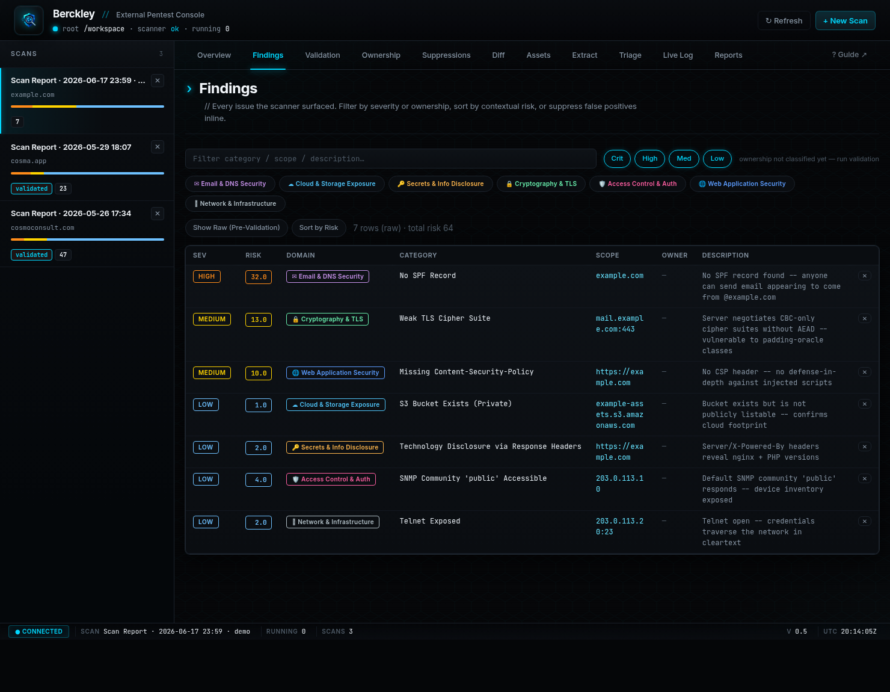

# Berckley — External Attack-Surface Scanner + Console


Berckley scans an organization's **external** attack surface from a list of
domains/IPs, classifies and validates the findings, scores the overall posture,
and produces analyst- and executive-facing reports — all driveable from a
single-page web console.

## Screenshots

**Overview** — security-posture score (0–100 + A–F grade), severity tiles,
risk-weighted hosts, and findings grouped by security domain:



**Findings** — filterable table with contextual risk scores, security-domain
badges, ownership tags, and inline false-positive suppression:



> Screenshots use a synthetic demo scan (`example.com` + documentation-range
> IPs) — no real engagement data.

## Pipeline

```
 domains / IPs
      │
      ▼
┌──────────────┐   pentest_<ts>/        ┌───────────────────┐      ┌──────────────────────┐
│ extpentest.sh│ ─────────────────────▶ │  Dashboard (Docker)│ ───▶ │  Reports (mgmt + soc) │
│  the scanner │   report/findings.tsv  │  FastAPI + web UI  │      │  HTML  ·  PDF         │
└──────────────┘   assets/, dns/, ...   └───────────────────┘      └──────────────────────┘
   9 phases:                              parse · validate ·          nw_report_mgmt.sh
   osint→dns→recon→tls→headers            classify · score             nw_report_soc.sh
   →webapp→cve→auth→report                                            (+ injected extras)
```

Each scan writes a self-contained `pentest_<YYYYMMDD>_<HHMMSS>/` directory. The
core artifact is `report/findings.tsv` — one row per finding:

```
SEVERITY <TAB> TITLE <TAB> SCOPE <TAB> DESCRIPTION
```

Everything downstream (dashboard, validation, scoring, reports) reads from that.

## Repo layout

| Path | What it is |
|------|------------|
| `extpentest.sh` | The scanner. 9 phases; writes `pentest_*/`. `./extpentest.sh -h` for options. |
| `nw_report_mgmt.sh` | Management / executive HTML report generator. `./nw_report_mgmt.sh <pentest_dir> [out.html]` |
| `nw_report_soc.sh` | SOC / technical HTML report generator. Same calling convention. |
| `dashboard/` | FastAPI + single-page console (runs in Docker). See [dashboard/README.md](dashboard/README.md). |
| `dashboard/taxonomy.py` | Single source of truth: maps each finding to one **security domain**. See [dashboard/CATEGORIES.md](dashboard/CATEGORIES.md). |
| `dashboard/scorecard.py` | Single source of truth: the 0–100 **posture score** + A–F grade. |
| `pentest_*/` | Per-engagement scan outputs (git-ignored — big, target-specific). |
| `asset_tags.json`, `suppressions.json` | Persisted analyst state (owner tags, accepted false positives). |

## Quick start

**Run a scan** (needs the scanner's CLI tools on PATH, or run it inside the
dashboard container which ships them):

```bash
./extpentest.sh -d example.com            # see ./extpentest.sh -h for all flags
```

**Run the console** (reads existing `pentest_*/` and can launch new scans):

```bash
cd dashboard
docker compose up --build -d              # → http://127.0.0.1:8080
```

The compose file mounts the repo root at `/workspace`, so existing scans, the
scanner, and the report generators are all reachable from inside the container.

**Generate reports** — one click in the console, or directly:

```bash
./nw_report_mgmt.sh pentest_20260529_180758 mgmt.html
./nw_report_soc.sh  pentest_20260529_180758 soc.html
```

Reports carry a **posture score**, a **by-security-domain** breakdown, and
(when validation/ownership have been run) risk-weighted and ownership sections.

## Docs

- [dashboard/README.md](dashboard/README.md) — console features, Docker/dev run, full API surface.
- [dashboard/CATEGORIES.md](dashboard/CATEGORIES.md) — the security-domain taxonomy and its finding-type distribution.
- In-app user guide — open **? Guide** in the console (`dashboard/static/guide.html`).
